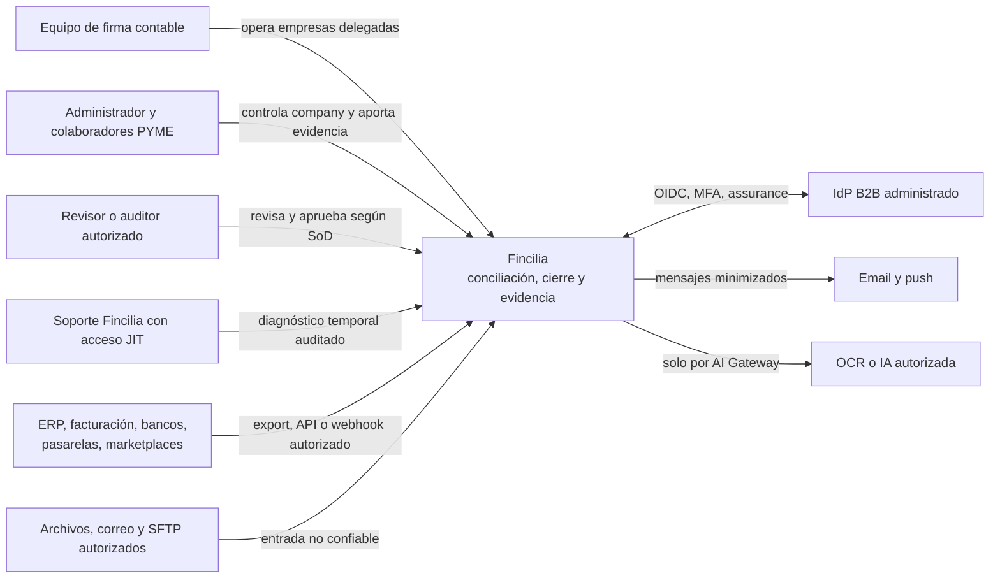
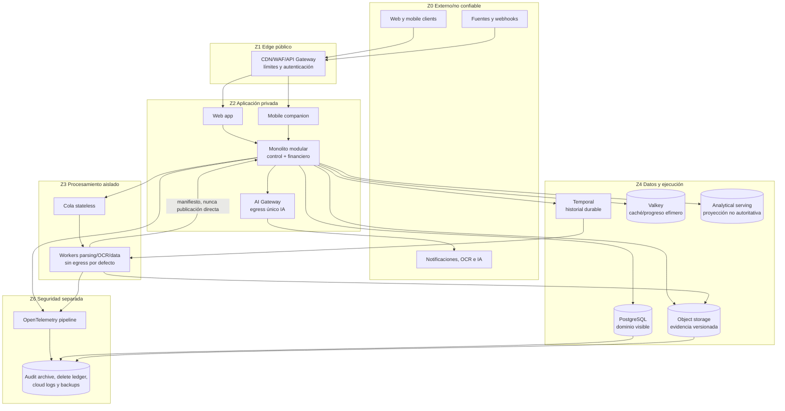
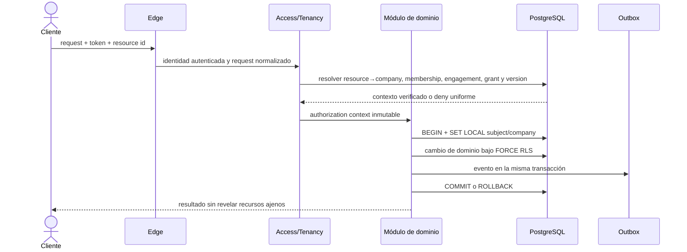
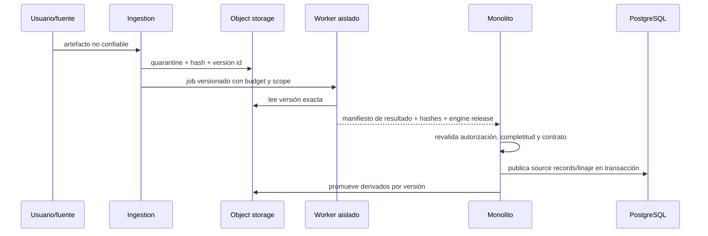

# C4 v0 — arquitectura ejecutable de Fincilia

| Campo | Valor |
|---|---|
| Tarea | FNC-ARC-001 |
| Estado | Review pending |
| Gate | S1-READY |
| Owner requerido | Architecture |
| Revisores | Security y Platform |
| Datos autorizados | Exclusivamente sintéticos |
| Modelo ejecutable | `docs/architecture/module-boundaries.json` |

Este documento define fronteras y dependencias, no proveedor cloud ni topología productiva. A-01 validó técnicamente el shape monolito modular + workers; la aceptación humana del stack sigue pendiente. A-02 —región, proveedor y transmisión— permanece abierta.

## 1. Nivel 1 — contexto

### Actores y límites de autoridad

| Actor | Puede | No adquiere por defecto |
|---|---|---|
| Firma contable | Operar companies mediante engagement y grant vigentes | Propiedad de company o acceso financiero por ser admin |
| PYME | Conservar control, delegar/revocar, aportar y consultar | Capacidad de aprobar sin rol/SoD |
| Revisor/auditor | Revisar evidencia dentro de alcance y periodo | Mutación o exportación privilegiada implícita |
| Soporte | Acceso temporal, mínimo y justificado mediante break-glass | Grant financiero persistente o decisión contable |

Fincilia no es ERP, banco, iniciador de pagos, prestador contable, autoridad fiscal ni proveedor tecnológico DIAN en el alcance inicial.

## 2. Sistemas externos

| Sistema | Dirección | Confianza | Regla |
|---|---|---|---|
| IdP B2B | Bidireccional | Identidad externa verificada, claims no suficientes para company | Fincilia resuelve autorización server-side |
| ERP/proveedor de facturación | Entrada y export controlado | No confiable hasta verificar fuente/completitud | Adaptador versionado; archivos permanecen fallback |
| Banco/agregador/pasarela | Entrada | Externo y parcialmente disponible | Nunca almacenar credenciales; IDs no implican unicidad económica |
| Correo/SFTP/upload | Entrada | Hostil | Quarantine, límites, hash, scan y promoción controlada |
| Email/push | Salida | Canal observable | Push sin monto/dato sensible; contenido minimizado |
| OCR/IA | Salida/retorno | Proveedor externo | Solo AI Gateway, redacción fail-closed y política por company |

## 3. Nivel 2 — contenedores y planos

### Catálogo de contenedores

| Contenedor | Responsabilidad | Fuente autoritativa | Nunca debe hacer |
|---|---|---|---|
| Web | Investigación, importación, mapping, conciliación, cierre e informes | No | Autorizar por estado cliente |
| Mobile companion | Captura, tareas, alertas y decisión simple | No | Mapping masivo o cierre complejo inicial |
| Edge | TLS, WAF, rate limit, autenticación y routing | No | Resolver grants financieros |
| Monolito modular | Autorización, invariantes, transacciones y publicación canónica | Sí, mediante PostgreSQL | Ejecutar parser hostil en proceso |
| Workers | Extracción y cómputo acotado | No | Escribir estado financiero canónico |
| PostgreSQL | Dominio, grants, decisiones y estado visible | Dominio y workflow visible | Guardar binarios grandes o secretos de conectores |
| Object storage | Evidencia por versión y derivados | Bytes/versiones | Autorizar acceso por key suministrada |
| Temporal | Espera humana, timers e historial durable | Ejecución durable | Duplicar verdad financiera |
| Cola | Entrega al menos una vez de trabajo stateless | No | Reintentar efectos no idempotentes a ciegas |
| Valkey | Cache, locks acotados, heartbeat/progreso | No | Ser fuente de permisos, cierre o dinero |
| Analytical serving | Dashboards y agregados reconstruibles | No | Autorizar o certificar informes |
| AI Gateway | Política, minimización, redacción, proveedor y costo | Registro de llamada, no finanzas | Calcular dinero o confirmar decisiones |
| Security archive | Auditoría/digests, delete ledger, logs y backup segregado | Auditoría y borrado | Servir consultas financieras normales |

Temporal se incorpora cuando existan esperas humanas/workflows largos; Valkey solo cuando una necesidad medida justifique caché o coordinación. El modelo no obliga a desplegarlos durante E0.

## 4. Planos lógicos

| Plano | Módulos | Estado que posee |
|---|---|---|
| Control | Tenancy, Access, Sources, Platform, Usage, Notifications | Companies, engagements, grants, fuentes, jobs, releases y entitlements |
| Financiero | Finance, Reconciliation, Close | Movimientos, obligaciones, saldos, decisiones, statements y snapshots |
| Evidencia | Ingestion y Clean | Artefactos, documentos, datasets, recetas, source records y linaje |
| Analítico | Reporting, Risk y Analytics | Informes versionados, señales/casos y proyecciones reconstruibles |
| Seguridad | Audit y AI Gateway | Eventos/digests, delete ledger y política de egress IA |

La pertenencia a un plano no concede acceso de escritura a otro. `MODULE_BOUNDARIES.md` y el modelo JSON fijan ownership conceptual único.

## 5. Secuencia company-scoped

El servidor resuelve la company desde el recurso; no confía en `company_id` enviado. Revocar engagement incrementa `authorization_version`; jobs, links, sessions y caches antiguos fallan cerrados.

## 6. Secuencia de evidencia y worker

La transición quarantine→raw/derived es explícita. Una salida worker jamás se vuelve hecho financiero solo por estar bien formada.

## 7. Autoridad y recuperación

| Store | Autoridad exacta | Reconstrucción/recuperación |
|---|---|---|
| PostgreSQL | Dominio y estado de workflow visible | Backup + WAL; restore reaplica tombstones/delete ledger |
| Object storage | Evidencia binaria y versiones | Versioning/inventario; raw aceptado no se sobrescribe |
| Temporal | Historial durable de ejecución | Reconciliador compara ejecución con estado visible |
| Valkey | Ninguna | Se pierde/reconstruye sin cambiar decisiones |
| Analytical store | Ninguna | Rebuild desde snapshots/eventos autorizados |
| Security archive | Audit digest y delete ledger | Separado del restore ordinario |

## 8. Reglas de egress

- Workers nacen sin egress; cada excepción es allowlist versionada.
- IA externa solo sale por AI Gateway y nunca recibe raw completo por defecto.
- Conectores usan adaptadores con scopes, timeouts, idempotencia y secretos en vault.
- Telemetría usa allowlist de campos; no payload, credenciales, PII o montos salvo decisión específica.
- Exports usan autorización reciente, version id, TTL corto y evento privilegiado.

## 9. Modos degradados

| Falla | Comportamiento seguro |
|---|---|
| IdP no disponible | Sesiones no renovables expiran; no bypass local |
| Valkey no disponible | Cache miss/progreso degradado; dominio continúa desde PostgreSQL |
| Analytics no disponible | Dashboard degradado; conciliación y cierre no cambian |
| Worker/conector falla | Job visible y acotado; archivo/manual permanece fallback |
| IA/OCR no disponible | Parser/regla/manual; nunca bloquear acceso a evidencia original |
| Temporal no disponible | No iniciar workflows largos; estado financiero no se infiere del cache |
| Object storage no disponible | No publicar sin evidencia/lineage; operación queda pendiente |

## 10. Decisiones abiertas

| ID | Decisión | Estado |
|---|---|---|
| A-01 / ADR-001 | Monolito modular NestJS/TS + workers Python | Spike PASS; revisión humana pendiente |
| ADR-002 | PostgreSQL 17, query/migration tooling | Versión/patrón validados; tooling pendiente |
| A-02 | Proveedor, región, celdas y transmisión | Abierta; no inferir |
| FNC-SEC-001 | Matriz RBAC/ABAC/SoD | 61 tests PASS; review pending con brechas registradas |
| FNC-ARC-002 | DFD y clasificación por flujo | Modelo y 13 pruebas PASS; review pending |
| FNC-SEC-002 | Threat model y pruebas de riesgo | 15 escenarios y 13 pruebas PASS; review pending |
| FNC-DOM-002 | Modelo canónico financiero | 20 entidades y 20 pruebas PASS; review pending |
| FNC-DOM-003 | Completitud y conciliación de saldos | 12 controles y 23 pruebas PASS; review pending |
| FNC-PLT-002 | Compose local del producto | No iniciar hasta aceptar contenedores mínimos |

## 11. Verificación

- `python -m tools.architecture_model.validate` valida modelo y ownership.
- Tests negativos rechazan multi-owner, dependencia desconocida, ciclo y autoridad analítica/cache.
- FNC-PLT-001 demostró RLS, contexto de pool, outbox y worker idempotente.
- FNC-SEC-001 materializa autorización y SoD sin modificar este modelo.

Este artefacto queda `Review pending` hasta revisión independiente de Architecture, Security y Platform.
