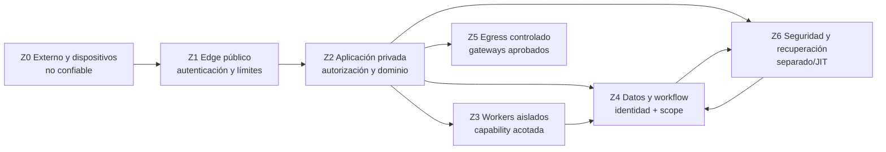
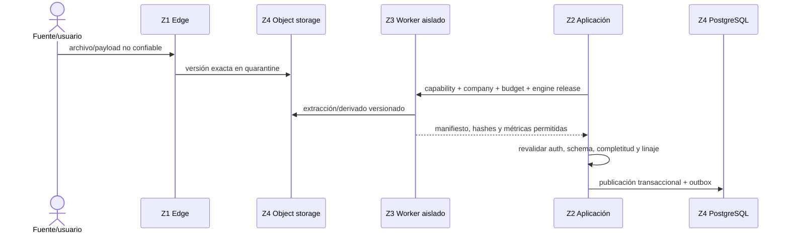
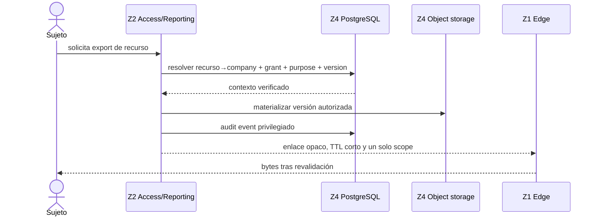

# DFD v0 — flujos, clasificación y fronteras de confianza

| Campo | Valor |
|---|---|
| Tarea | FNC-ARC-002 |
| Estado | Review pending |
| Gate | S1-READY |
| Owners requeridos | Architecture + Security |
| Revisor adicional | Privacy |
| Datos autorizados | Exclusivamente sintéticos |
| Modelo ejecutable | `docs/architecture/dfd-flows.json` |

Este DFD concreta el C4 sin elegir proveedor cloud, región, IdP, antivirus, OCR, cola ni servicio de IA. El JSON es el catálogo comprobable; este documento explica las decisiones. Ambos deben cambiar juntos.

## 1. Zonas de confianza



| Zona | Contenido | Postura | Regla de entrada |
|---|---|---|---|
| Z0 | Dispositivos, archivos, correo, SFTP, APIs y proveedores | Hostil o parcialmente verificable | Nunca autoriza por sí mismo |
| Z1 | WAF/CDN/API gateway y receptores públicos | Expuesto | TLS, límites, autenticación o firma/replay |
| Z2 | Monolito modular y AI Gateway lógico | Privado | Identidad de workload y contexto server-side |
| Z3 | Workers de parsing/OCR/data | Aislado | Job firmado, presupuesto, versión y capability |
| Z4 | PostgreSQL, objetos, workflow, cache y proyecciones | Restringido | Identidad de workload, company scope y least privilege |
| Z5 | Proxies/gateways de salida | Deny-by-default | Allowlist por destino, finalidad y política |
| Z6 | Auditoría, delete ledger, backups y plano cloud | Segregado | JIT/break-glass, evidencia y cuenta separada |

`Z5` no es internet: es el punto de control previo. El proveedor externo sigue en `Z0`. Un flujo que declara egress no puede saltar `Z5`.

## 2. Clasificación y reglas de manejo

| Clase | Ejemplos | Persistencia | Logs/egress |
|---|---|---|---|
| `public` | Documentación publicada | Permitida | Permitido con minimización |
| `internal` | IDs técnicos, versión, métricas operativas | Stores aprobados | Allowlist explícita |
| `confidential` | Identidad y configuración de cliente | Cifrada, retención definida | No payload; egress por contrato |
| `financial_sensitive` | Movimientos, saldos, documentos, cierre | Company-scoped, cifrada y con linaje | Sin montos/cuentas en logs; egress excepcional |
| `secret` | Tokens y credenciales | Solo vault o referencia opaca | Nunca logs ni payload de negocio |
| `prohibited` | CVV, contraseña bancaria/DIAN, secreto innecesario | No se recibe ni persiste | Rechazo antes de raw y cero egress |

En E0 solo se usan equivalentes sintéticos permitidos. La clasificación no habilita datos reales ni cambia DRG-00.

## 3. Flujos de extremo a extremo

| ID | Flujo | Origen → destino | Clase máxima | Persistencia principal | Condición fail-closed |
|---|---|---|---|---|---|
| F01 | Autenticación y sesión | Z0 → Z1 → Z2 | `confidential` | PostgreSQL/sesión referenciada | IdP/assurance no verificable: deny |
| F02 | Upload a quarantine | Z0 → Z1 → Z4 | `financial_sensitive` | Object storage quarantine | Firma, tamaño o tipo inválido: quarantine/reject |
| F03 | Scan y promoción | Z4 → Z3 → Z4 | `financial_sensitive` | Raw versionado + decisión | Scan incompleto: no promoción |
| F04 | Parse/extracción | Z4 → Z3 → Z4 | `financial_sensitive` | Derivado + manifiesto | Worker no publica canónico |
| F05 | Mapping/publicación | Z4 → Z2 → Z4 | `financial_sensitive` | Dataset/linaje PostgreSQL+objetos | Ambigüedad/completitud: no publicar |
| F06 | Conciliación/cierre | Z4 → Z2 → Z4 | `financial_sensitive` | PostgreSQL + snapshot | RLS/SoD/saldo/evidencia fallan: deny |
| F07 | Informe/exportación | Z4 → Z2 → Z1 | `financial_sensitive` | Export versionado temporal | Revalidación o TTL falla: no enlace |
| F08 | OCR/IA autorizada | Z2 → Z5 → Z0 | `confidential` | Registro minimizado de llamada | Redacción/política falla: cero egress |
| F09 | Conector/webhook | Z0 → Z1 → Z2 | `financial_sensitive` | Evento idempotente/versionado | Firma/replay/completitud falla: no publicar |
| F10 | Auditoría/digest | Z2/Z3/Z4 → Z6 | `confidential` | Archivo append-only/digest | Evento no permitido: redactar/rechazar |
| F11 | Borrado/tombstone | Z2 → Z6 → Z4 | `confidential` | Delete ledger fuera de restore | Ledger no disponible: no afirmar borrado |
| F12 | Restore/reconciliación | Z6 → Z4 | `financial_sensitive` | Stores restaurados | Tombstones no reaplicados: no abrir servicio |
| F13 | Revocación engagement | Z2 → Z4/Z6 | `confidential` | Grants/version/audit | No invalidar jobs/links/cache: revocación incompleta |

El detalle de actores, propósito, protocolos, stores, retención, campos de log, amenazas, controles, pruebas y degradación vive en el modelo JSON y es exigido por CI.

## 4. Secuencia de ingesta y publicación



No existe promoción implícita. `partial`, `unknown` y `unverified` se conservan para investigación, pero no alimentan auto-match, cierre ni reporte certificado.

## 5. Secuencia de exportación privilegiada



El nombre/key enviado por cliente nunca resuelve autoridad. Los enlaces se invalidan por expiración y `authorization_version`; el download vuelve a comprobar alcance.

## 6. Egress e IA

- Workers nacen sin salida. Una excepción exige destino, finalidad, clase, owner, expiración y prueba de bloqueo.
- La IA externa solo recibe texto/campos minimizados por AI Gateway; raw completo no sale por defecto.
- Redacción y policy son fail-closed. No se hace fallback directo desde un worker o cliente.
- Un LLM no calcula dinero, confirma matches, autoriza, cambia reglas ni cierra periodos.
- Los conectores usan su gateway/adaptador; secretos viven en vault y solo se transportan como referencias.
- Push/email excluye montos, cuentas, NIT y descripción financiera en pantalla bloqueada.

## 7. Telemetría por allowlist

Campos operativos permitidos típicos: `event_name`, IDs internos opacos, `company_scope_hash`, `engine_release_id`, `status_code`, `duration_bucket`, conteos agregados y `trace_id`. Se prohíben payload/raw, nombres originales, celdas, tokens, credenciales, NIT, cuenta, referencia, monto y texto OCR. Un campo nuevo no entra por omisión: requiere cambio de contrato y revisión Privacy/Security.

## 8. Persistencia, retención y recuperación

| Store | Contenido autorizado | Regla |
|---|---|---|
| PostgreSQL | Dominio, grants, decisiones, índices y linaje | FORCE RLS; rol app no owner/superuser |
| Object storage | Quarantine, raw y derivados versionados | URLs cortas; raw aceptado inmutable |
| Temporal | Historial durable y timers | No reemplaza estado financiero visible |
| Valkey | Cache/progreso efímero | Sin verdad financiera ni grants autoritativos |
| Analytics | Proyecciones reconstruibles | No autoriza ni certifica |
| Security archive | Audit, digest y delete ledger | Fuera del restore ordinario; acceso JIT |

La política concreta de días queda abierta a L-01/A-02 y no se inventa en este DFD. Mientras tanto cada flujo usa un `retention_policy_id`, no una cifra falsa. Restore debe reaplicar tombstones antes de reabrir servicio y comprobar que derivados/proyecciones no resucitaron datos.

## 9. Amenazas y pruebas negativas

El catálogo ejecutable cubre spoofing/replay, elevación de privilegio, cross-company, archivo hostil, publicación incompleta, egress no autorizado, fuga por logs, enlace export reutilizable, restore con resurrección, revocación tardía y manipulación de auditoría. Cada flujo referencia controles y al menos una prueba negativa; las amenazas altas no pueden quedar sin prueba.

FNC-SEC-002 consumirá estos IDs para el threat model formal. Este DFD no declara riesgo residual aceptado: eso exige owner humano y fecha.

## 10. Modos degradados

| Falla | Comportamiento seguro |
|---|---|
| IdP/assurance | No renovar ni crear sesión privilegiada |
| Scan/worker | Mantener quarantine/job visible; no promover/publicar |
| Object storage | No publicar sin evidencia y lineage |
| PostgreSQL/RLS | Deny; nunca usar cache como autoridad |
| AI/OCR | Parser/manual; cero bypass de gateway |
| Egress gateway | Mantener operación pendiente o usar archivo autorizado |
| Auditoría/delete ledger | Bloquear operación privilegiada afectada |
| Restore | No abrir servicio hasta tombstones e inventario reconciliados |

## 11. Decisiones abiertas

| ID | Decisión | Efecto |
|---|---|---|
| A-02 | Cloud, región, celdas y transmisión | Topología, residencia y subencargados |
| L-01 | Retención, borrado y legal hold | Duraciones y evidencia de purga |
| L-02 | IA/OCR externo y DPA | Proveedores/clases/finalidades permitidas |
| S-01 | Política PAN/PCI antes de raw | Detector, cuarentena y respuesta |
| B-01 | Cobertura y contrato de agregador | Flujos F09 y COGS; archivo sigue fallback |
| FNC-SEC-002 | Threat model | Riesgo residual, owners y tratamiento |

## 12. Verificación y estado

```powershell
python -m tools.dfd_model.validate
python -m unittest tools.dfd_model.test_validate -v
```

El validador exige zonas, clases, F01–F13, checklist completo, referencias válidas y contratos especiales de worker, export, IA, restore y revocación. Este artefacto queda `Review pending`; no supera S1-READY ni autoriza datos reales.
