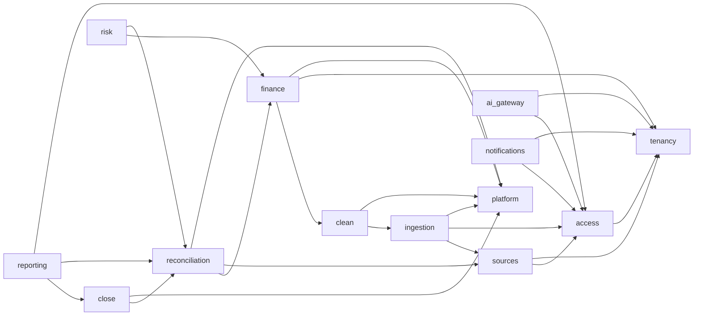

# Límites de módulos v0

| Campo | Valor |
|---|---|
| Estado | Review pending |
| Tarea | FNC-ARC-001 |
| Contrato ejecutable | `docs/architecture/module-boundaries.json` |
| Validador | `python -m tools.architecture_model.validate` |

## 1. Regla central

Cada entidad conceptual tiene exactamente un módulo escritor. Un módulo puede consumir un port, query estable, snapshot o evento de otro, pero no escribir su tabla, bucket namespace o estado interno. Estar en el mismo monolito no elimina el límite.

Las entidades del JSON son ownership conceptual previo al esquema v0.1; no autorizan crear tablas antes de FNC-DOM-002..005.

## 2. Ownership

| Módulo | Plano | Posee | Prohibición principal |
|---|---|---|---|
| Tenancy | Control | organization, company, engagement, authorization version | Subordinar company a firma o mover histórico |
| Access | Control | subject, identity, memberships, grants, service principals | Autorizar solo por claim/rol administrativo |
| Sources | Control | fuentes, conexiones lógicas, expectativas y registro de conectores | Persistir secretos en DB o prometer feed universal |
| Ingestion | Evidencia | artifact, document, processing run, quarantine decision | Publicar source record o movimiento financiero |
| Clean | Evidencia | raw record, dataset, schema, mapping, recipe, source record, lineage, overlay | Modificar raw o decidir hechos financieros |
| Finance | Financiero | contraparte, cuenta, obligación, movimiento, dedupe económico versionado, settlement, ledger y balance | Leer tablas internas de ingesta o deduplicar por fecha/monto sin decisión trazable |
| Reconciliation | Financiero | completitud, candidates, groups, decisions, exceptions y statement | Confirmar por LLM o usar fuente parcial silenciosamente |
| Close | Financiero | cycle, tasks, approvals, snapshot y reminder policy | Cerrar sin statement, evidencia o SoD |
| Reporting | Analítico | report definition/snapshot, export y schedule | Autorizar desde warehouse/proyección |
| Risk | Analítico | signal, investigation y resolution | Declarar fraude o mutar conciliación |
| Usage | Control | entitlement, usage event/ledger y credits | Bloquear seguridad, privacidad o export básico por plan |
| Platform | Control | outbox, inbox, job, engine release, delivery attempt y dead-letter item | Ser verdad financiera o poseer retries de todos los niveles |
| Audit | Seguridad | audit/access event, delete ledger y digest | Actualizar/borrar eventos o servir payload financiero |
| Analytics | Analítico | proyecciones reconstruibles | Convertirse en fuente de autorización/cierre |
| AI Gateway | Seguridad | request record, eval y provider policy | Calcular dinero, autorizar, confirmar o cerrar |
| Notifications | Control | preferences y delivery | Incluir dato sensible no minimizado |

El inventario detallado y machine-readable vive en el JSON; si tabla y JSON divergen, la tarea falla revisión.

## 3. Dependencias permitidas

Audit, Analytics y Usage son consumidores sink de eventos/proyecciones y no se convierten en dependencias síncronas del camino financiero. El validador rechaza ciclos, self-dependencies y referencias a módulos desconocidos.

## 4. Formas de colaboración

| Forma | Uso | Restricción |
|---|---|---|
| Comando síncrono | Invariante inmediata y transacción local | Solo API pública del owner; no repositorio ajeno |
| Query/port síncrono | Verificación necesaria para comando | DTO estable, company-scoped y sin filtrar storage model |
| Evento outbox | Efecto posterior/proyección | At-least-once; consumer idempotente e inbox cuando aplique |
| Job worker | Parsing/cómputo no confiable | Input/output versionados; retorna manifiesto |
| Snapshot | Cierre/informe reproducible | Version id y engine release; nunca “latest” implícito |

No se usa evento para completar una invariante que debe ser atómica. No se crea una transacción distribuida temprana.

## 5. Reglas de persistencia

- Repositorio y tablas pertenecen al owner del módulo.
- Foreign keys financieras incluyen `company_id` cuando exista relación company-scoped.
- Una FK permite integridad, no escritura cruzada.
- Vistas públicas del módulo son contratos read-only, `security_invoker` cuando aplique.
- Proyecciones materializadas se sirven mediante tabla/proyección tenant-scoped; no grants directos a materialized views.
- Raw/evidencia se referencia por hash + version id; no se sobrescribe.
- Un módulo no usa JSONB ajeno como contrato informal.

## 6. Access y tenancy como capacidades transversales

Access resuelve la decisión; Tenancy posee la frontera company/engagement. Los módulos reciben un `authorization_context` de petición ya verificado y vuelven a aplicar RLS dentro de la transacción. Cuando una capability sobrevive a la petición, Access posee `issued_authorization_context` y su tombstone append-only `issued_authorization_revocation` (V0021); no se convierte por ello en estado financiero canónico.

Desde V0022, Ingestion conserva en `processing_run` la referencia company-scoped a
esa capability. La referencia no transfiere ownership: Access sigue decidiendo su
vigencia e Ingestion la exige al encolar, reclamar, escribir cada lote y cerrar.

El contexto contiene como mínimo subject, company resuelta desde recurso, ruta directa/delegada, grant/action/purpose, assurance y authorization version. No contiene una autorización eterna: jobs, exports, links y confirmaciones críticas revalidan sujeto, membresía, engagement, grant, versión, expiración y revocación en PostgreSQL. Las referencias persistentes son HMAC company-scoped y no payload ni identificadores en claro.

## 7. Audit sin acoplamiento

Cada módulo emite audit facts mediante un port/outbox con allowlist. Audit es append-only y no recibe payload por comodidad. Si Audit está temporalmente degradado, una acción crítica definida fail-closed no se ejecuta; las demás siguen la política explícita, nunca un fallback silencioso.

## 8. Workers y publicación

Workers pueden leer versiones autorizadas y escribir derivados en namespace temporal/asignado. Devuelven:

- input hashes/version ids;
- parser/model/recipe/engine release;
- output hash, counts y status;
- warnings/errores clasificados;
- budget consumido y evidencia de idempotencia.

El owner Ingestion/Clean valida el manifiesto. Finance publica únicamente mediante comandos canónicos posteriores. Un worker jamás tiene grants para tablas de conciliación o cierre.

## 9. AI Gateway

AI Gateway es un port de egress, no un módulo de dominio financiero. Recibe fragmentos minimizados, aplica política company-scoped y registra proveedor/propósito/costo/eval. Sus outputs son propuestas no autoritativas y se validan con reglas deterministas/humanas.

## 10. Enforcement progresivo

| Gate | Enforcement |
|---|---|
| E0 | JSON ejecutable, validador, tests de ownership/dependencias y revisión documental |
| Sprint 1 | Estructura de módulos, imports públicos y tests de arquitectura |
| Persistencia v0.1 | Roles/repositorios por módulo, migraciones owner y grants mínimos |
| CI maduro | Lint de imports, schema/event compatibility y ownership de migraciones |

## 11. Cambios

Añadir módulo, entidad, dependencia o autoridad requiere:

1. tarea con owner;
2. actualizar JSON y documentación;
3. test positivo/negativo proporcional;
4. ADR si cambia fuente autoritativa, tenancy, persistencia o contrato público;
5. revisión independiente.

No se acepta “dependencia temporal” sin ID y fecha de eliminación.
